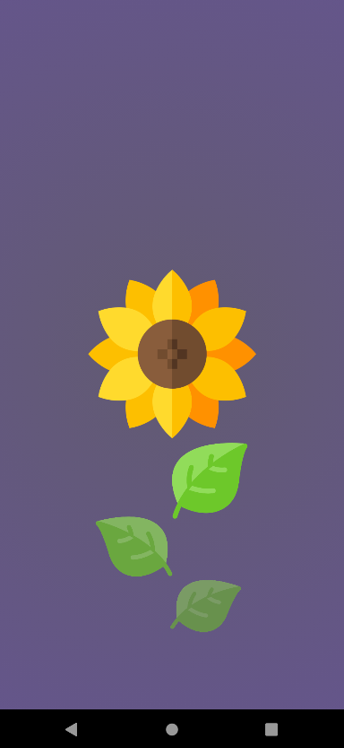
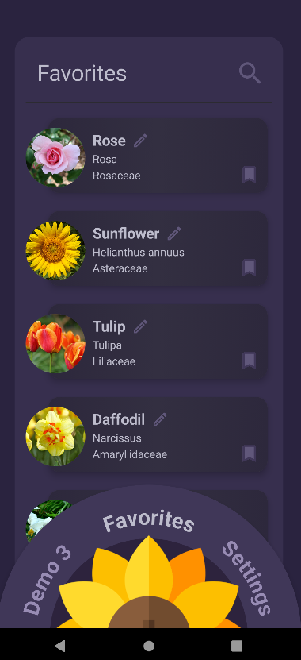
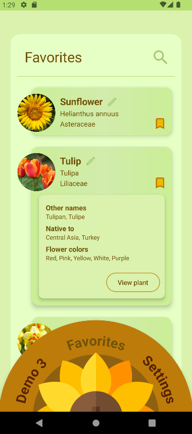

# Kotlin Demo - PlantBuddies
This is a demo for the PlantBuddies application, and showcases a selection of the available
functionalities. Unlike the full version, this demo does not utilise the Perenual API nor the related cacheing mechanism.

## Screenshots

    
    
    

## Icons
The sunflower icon featured on the screen selector and splash screen is designed by Freepik, 
and can be found on https://www.freepik.com/icon/sunflower_1497177#fromView=search&page=1&position=6&uuid=d9e6976c-a51e-48f8-96a4-aee4040c0251

## Attributions
PlantBuddies was originally designed and developed by a group of 4 developers. This demo mostly features code written by Sara Djordjevic.