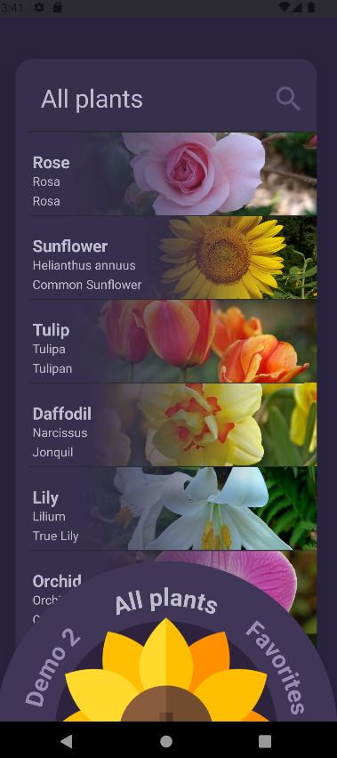

# Kotlin Demo - PlantBuddies
This is a demo for the PlantBuddies application. It showcases a limited selection of the available
functionalities. This demo does not utilise the PerenualAPI or the related cacheing mechanism, unlike the full version. 
Instead, this demo uses locally stored test data.

## Attributions
### Authors
PlantBuddies was originally designed and developed by a group of 4 bachelor students at
NTNU for a mobile programming class. This demo mostly features code written by Sara Djordjevic.

### Icons
The sunflower icon featured on the screen selector and splash screen is designed by Freepik,
and can be found on https://www.freepik.com/icon/sunflower_1497177#fromView=search&page=1&position=6&uuid=d9e6976c-a51e-48f8-96a4-aee4040c0251

## Screenshots

    
    
    

    
    
    

